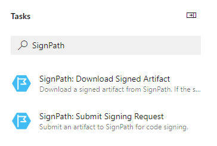

# SignPath Azure DevOps Build Pipeline Tasks

Build tasks to integrate [SignPath.io](https://about.signpath.io) code signing into your build pipeline.

Supported methods: Authenticode, NuGet, ClickOnce manifest signing, OPC signing. 
Supported file formats: EXE, DLL, PowerShell, MSI, CAB, AppX, nupkg, Office add-ins, VSIX and more. 

## How to use

After installing the extension, you can add one (or more) of the tasks to a new or existing build definition.

## Available tasks

* **SignPathSubmitSigningRequestTask**  
 Submit an artifact to SignPath. Either wait for the artifact to be signed synchronously and immediately download the resulting artifact, or, choose to write the signing request ID into an output variable and download the signed artifact later on using the SignPathDownloadSignedArtifact task.
* **SignPathDownloadSignedArtifactTask**  
 Download a signed artifact from SignPath. This task waits if the signing request has not yet been completed.

## Running on self-hosted agents

On self-hosted agents, the NuGetProvider needs to be available. You can install it by calling the following command on a PowerShell console with elevated permissions:

     Install-PackageProvider -Name NuGet -MinimumVersion 2.8.5.201

## Get the source

The [source](https://github.com/SignPath/Build-Integrations-AzureDevOps) for this extension is on GitHub. Take, fork, and extend.

## Feedback and issues

If you have feedback or issues, please [send an email](mailto:support@signpath.io) or file an issue on [GitHub](https://github.com/SignPath/Build-Integrations-AzureDevOps/issues)
